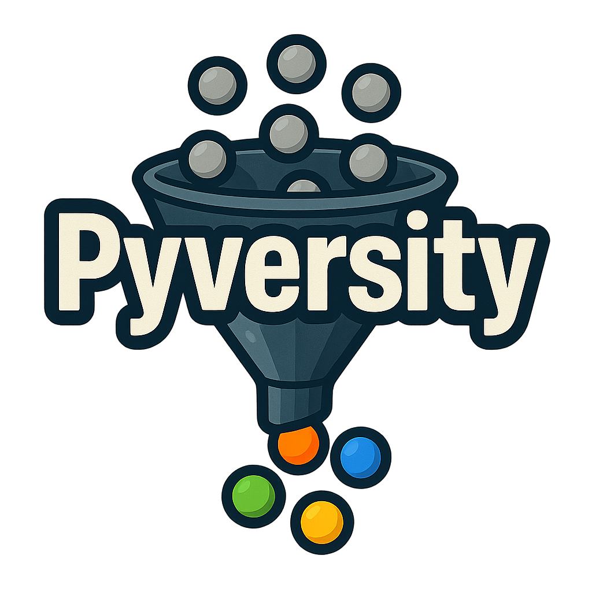

<h2 align="center">
  <br/>
  Fast Diversification for Search & Retrieval
</h2>

<div align="center">
  <h2>
    <a href="https://pypi.org/project/pyversity/"></a>
    <a href="https://pepy.tech/projects/pyversity"></a>
    <a href="https://app.codecov.io/gh/Pringled/pyversity">
      
    </a>
    <a href="https://github.com/Pringled/pyversity/blob/main/LICENSE">
      
    </a>
  </h2>


[Quickstart](#quickstart) •
[Supported Strategies](#supported-strategies) •
[Benchmarks](#benchmarks) •
[Motivation](#motivation) •
[Examples](#examples) •
[References](#references)

</div>

Pyversity is a fast, lightweight library for diversifying retrieval results.
Retrieval systems often return highly similar items. Pyversity efficiently re-ranks these results to encourage diversity, surfacing items that remain relevant but less redundant.

It implements several popular diversification strategies such as MMR, MSD, DPP, SSD, and Cover with a clear, unified API and [benchmarks](benchmarks/) for each strategy. More information about the supported strategies can be found in the [supported strategies section](#supported-strategies). The only dependency is NumPy, making the package very lightweight.


## Quickstart

Install `pyversity` with:

```bash
pip install pyversity
```

Diversify retrieval results:
```python
import numpy as np
from pyversity import diversify, Strategy

# Define embeddings and scores (e.g. cosine similarities of a query result)
embeddings = np.random.randn(100, 256)
scores = np.random.rand(100)

# Diversify the result
diversified_result = diversify(
    embeddings=embeddings,
    scores=scores,
    k=10, # Number of items to select
    strategy=Strategy.DPP, # Diversification strategy to use
    diversity=0.5 # Diversity parameter (higher values prioritize diversity)
)

# Get the indices of the diversified result
diversified_indices = diversified_result.indices
```

The returned `DiversificationResult` can be used to access the diversified `indices`, as well as the `selection_scores` of the selected strategy and other useful info. The strategies are extremely fast and scalable: this example runs in milliseconds.

The `diversity` parameter tunes the trade-off between relevance and diversity: 0.0 focuses purely on relevance (no diversification), while 1.0 maximizes diversity, potentially at the cost of relevance.

## Supported Strategies

The papers linked in [references](#references) provide more details on each strategy.

| Strategy                              | What It Does                                                                                   | Time Complexity           | When to Use                                                                                    |
| ------------------------------------- | ---------------------------------------------------------------------------------------------- | ------------------------- | ---------------------------------------------------------------------------------------------- |
| **MMR** (Maximal Marginal Relevance)  | Keeps the most relevant items while down-weighting those too similar to what's already picked. | **O(k · n · d)**          | Simple baseline. Fast, easy to implement, competitive results. Recommended `diversity`: 0.4–0.7 |
| **MSD** (Max Sum of Distances)        | Prefers items that are both relevant and far from *all* previous selections.                   | **O(k · n · d)**          | Best for maximum variety (ILAD), but may sacrifice relevance. Recommended `diversity`: 0.3–0.5 |
| **DPP** (Determinantal Point Process) | Samples diverse yet relevant items using probabilistic "repulsion."                            | **O(k · n · d + n · k²)** | **Recommended default.** Best overall in benchmarks: highest accuracy and diversity. Recommended `diversity`: 0.5–0.8 |
| **COVER** (Facility-Location)         | Ensures selected items collectively represent the full dataset's structure.                    | **O(k · n²)**             | Great for topic coverage or clustering scenarios, but slower for large `n`. |
| **SSD** (Sliding Spectrum Decomposition) | Sequence‑aware diversification: rewards novelty relative to recently shown items.     | **O(k · n · d)**          | Great for content feeds & infinite scroll where users consume sequentially. Recommended `diversity`: 0.6–0.9 |

Where **k** = number of items to select, **n** = number of candidates, **d** = embedding dimensionality.

## Benchmarks

All strategies are evaluated across 4 recommendation datasets. Full methodology and detailed results can be found in [`benchmarks`](benchmarks/).

DPP is the clear winner: it boosts ILAD/ILMD by 26-44% and 54-86% respectively while improving relevance by 1.8-3.1%. Use `diversity=0.5-0.8` for best overall results.

## Motivation

Traditional retrieval systems rank results purely by relevance (how closely each item matches the query). While effective, this can lead to redundancy: top results often look nearly identical, which can create a poor user experience.

Diversification techniques like MMR, MSD, COVER, DPP, and SSD help balance relevance and variety.
Each new item is chosen not only because it’s relevant, but also because it adds new information that wasn’t already covered by earlier results.

This improves exploration, user satisfaction, and coverage across many domains:

- E-commerce: Show different product styles, not multiple copies of the same product.
- News search: Highlight articles from different outlets or viewpoints.
- Academic retrieval: Surface papers from different subfields or methods.
- RAG / LLM contexts: Avoid feeding the model near-duplicate passages.
- Recommendation feeds: Keep content diverse and engaging over time.

## Examples

<details> <summary><b>Product / Web Search</b> — Simple diversification with MMR or DPP</summary> <br>

MMR and DPP work well as general-purpose diversifiers. In product search, use them to avoid showing near-duplicate results:

```python
from pyversity import diversify, Strategy

# Suppose you have:
# - item_embeddings: embeddings of the retrieved products
# - item_scores: relevance scores for these products

# Re-rank with MMR
result = diversify(
    embeddings=item_embeddings,
    scores=item_scores,
    k=10,
    strategy=Strategy.MMR,
)
```
</details>

<details> <summary><b>Literature Search </b> — Represent the full topic space with COVER</summary> <br>

COVER ensures the selected items collectively represent the full topic space. For academic papers, this means covering different subfields and methodologies:

```python
from pyversity import diversify, Strategy

# Suppose you have:
# - paper_embeddings: embeddings of the retrieved papers
# - paper_scores: relevance scores for these papers

# Re-rank with COVER
result = diversify(
    embeddings=paper_embeddings,
    scores=paper_scores,
    k=10,
    strategy=Strategy.COVER,
)
```
</details>

<details>
<summary><b>Conversational RAG</b> — Avoid redundant chunks with SSD</summary>
<br>

In conversational RAG, you want to avoid feeding the model redundant chunks. SSD diversifies relative to recent context, making it a natural fit:

```python
import numpy as np
from pyversity import diversify, Strategy

# Suppose you have:
# - chunk_embeddings (for retrieved chunks this turn)
# - chunk_scores (relevance scores for these chunks)
# - recent_chunk_embeddings (chunks shown in the last few turns (oldest→newest)

# Re-rank with SSD (sequence-aware)
result = diversify(
    embeddings=chunk_embeddings,
    scores=chunk_scores,
    k=10,
    strategy=Strategy.SSD,
    recent_embeddings=recent_chunk_embeddings,
)

# Maintain the rolling context window for recent chunks
recent_chunk_embeddings = np.vstack([recent_chunk_embeddings, chunk_embeddings[result.indices]])
```
</details>


<details> <summary><b>Infinite Scroll / Recommendation Feed</b> — Sequence-aware novelty with SSD</summary> <br>

In content feeds, users consume items sequentially. SSD introduces novelty relative to recently shown items, keeping the experience fresh:

```python
import numpy as np
from pyversity import diversify, Strategy

# Suppose you have:
# - feed_embeddings: embeddings of candidate items for the feed
# - feed_scores: relevance scores for these items
# - recent_feed_embeddings: embeddings of recently shown items in the feed (oldest→newest)

# Sequence-aware re-ranking with Sliding Spectrum Decomposition (SSD)
result = diversify(
    embeddings=feed_embeddings,
    scores=feed_scores,
    k=10,
    strategy=Strategy.SSD,
    recent_embeddings=recent_feed_embeddings,
)

# Maintain the rolling context window for recent items
recent_feed_embeddings = np.vstack([recent_feed_embeddings, feed_embeddings[result.indices]])
```
</details>


<details> <summary><b>Single Long Document</b> — Pick diverse sections with MSD</summary> <br>

When extracting from a long document, you want sections that cover different parts. MSD prefers items that are far apart from each other:

```python
from pyversity import diversify, Strategy

# Suppose you have:
# - doc_chunk_embeddings: embeddings of document chunks
# - doc_chunk_scores: relevance scores for these chunks

# Re-rank with MSD
result = diversify(
    embeddings=doc_chunk_embeddings,
    scores=doc_chunk_scores,
    k=10,
    strategy=Strategy.MSD,
)
```

</details>

<details> <summary><b>Advanced Usage</b> — Customizing Strategies</summary> <br

Some strategies support additional parameters. For example, the SSD (Sliding Spectrum Decomposition) strategy allows you to provide a set of `recent_embeddings` to encourage novelty relative to recently shown items. In addition to calling the supported strategies via the `diversify` function, you can also call them directly. For example, using SSD directly:

```python
from pyversity import ssd
import numpy as np

items_to_select = 10 # Number of items to select

new_embeddings = np.random.randn(100, 256) # Embeddings of candidate items
new_scores = np.random.rand(100) # Relevance scores of candidate items
recent_embeddings = np.random.randn(items_to_select, 256) # Embeddings of recently shown items

# Sequence-aware diversification with SSD
result = ssd(
    embeddings=new_embeddings,
    scores=new_scores,
    k=items_to_select, # Number of items to select
    diversity=0.5,# Diversity parameter (higher values prioritize diversity)
    recent_embeddings=recent_embeddings, # Embeddings of recently shown items
    # More SSD specific parameters can be set as needed
)

# Update the rolling context window by adding the newly selected items to recent embeddings
recent = np.vstack([recent_embeddings, new_embeddings[result.indices]])[-items_to_select:]
```
</details>

## References

The implementations in this package are based on the following research papers:

- **MMR**: Carbonell, J., & Goldstein, J. (1998). The use of MMR, diversity-based reranking for reordering documents and producing summaries. [Link](https://dl.acm.org/doi/pdf/10.1145/290941.291025)

- **MSD**: Borodin, A., Lee, H. C., & Ye, Y. (2012). Max-sum diversification, monotone submodular functions and dynamic updates. [Link](https://arxiv.org/pdf/1203.6397)

- **COVER**: Puthiya Parambath, S. A., Usunier, N., & Grandvalet, Y. (2016). A coverage-based approach to recommendation diversity on similarity graph. [Link](https://dl.acm.org/doi/10.1145/2959100.2959149)

- **DPP**: Kulesza, A., & Taskar, B. (2012). Determinantal Point Processes for Machine Learning. [Link](https://arxiv.org/pdf/1207.6083)

- **DPP (efficient greedy implementation)**: Chen, L., Zhang, G., & Zhou, H. (2018). Fast greedy MAP inference for determinantal point process to improve recommendation diversity.
[Link](https://arxiv.org/pdf/1709.05135)

- **SSD**: Huang, Y., Wang, W., Zhang, L., & Xu, R. (2021). Sliding Spectrum Decomposition for Diversified
Recommendation. [Link](https://arxiv.org/pdf/2107.05204)

## Author

Thomas van Dongen

## Citation

If you use Pyversity in your research, please cite the following:

```bibtex
@software{van_dongen_2025_pyversity,
  author       = {{van Dongen}, Thomas},
  title        = {Pyversity: Fast Diversification for Search & Retrieval},
  year         = {2025},
  publisher    = {Zenodo},
  doi          = {10.5281/zenodo.17628015},
  url          = {https://github.com/Pringled/pyversity},
  license      = {MIT}
}
```
