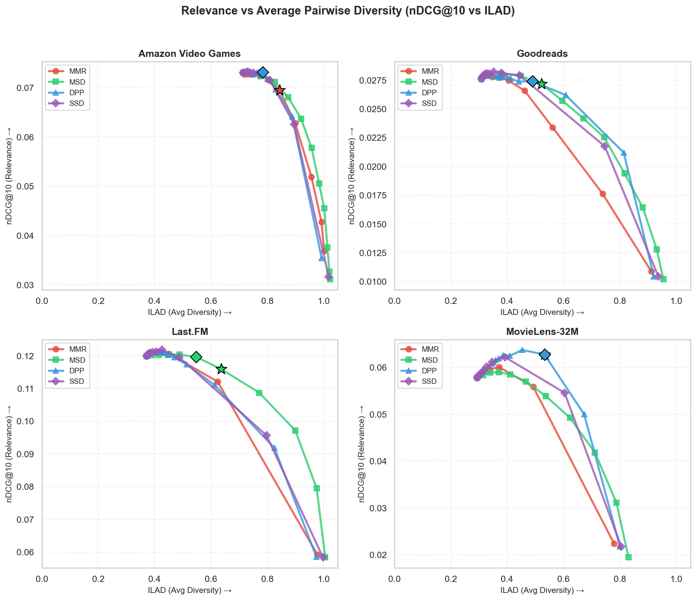
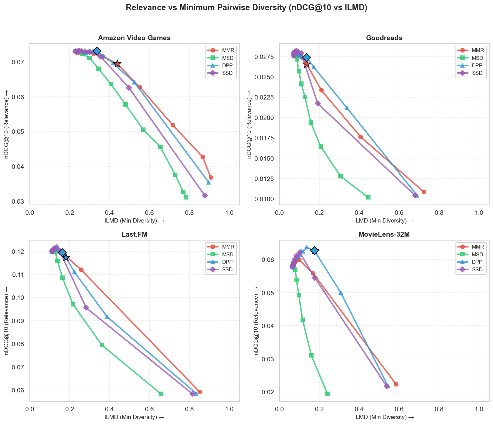
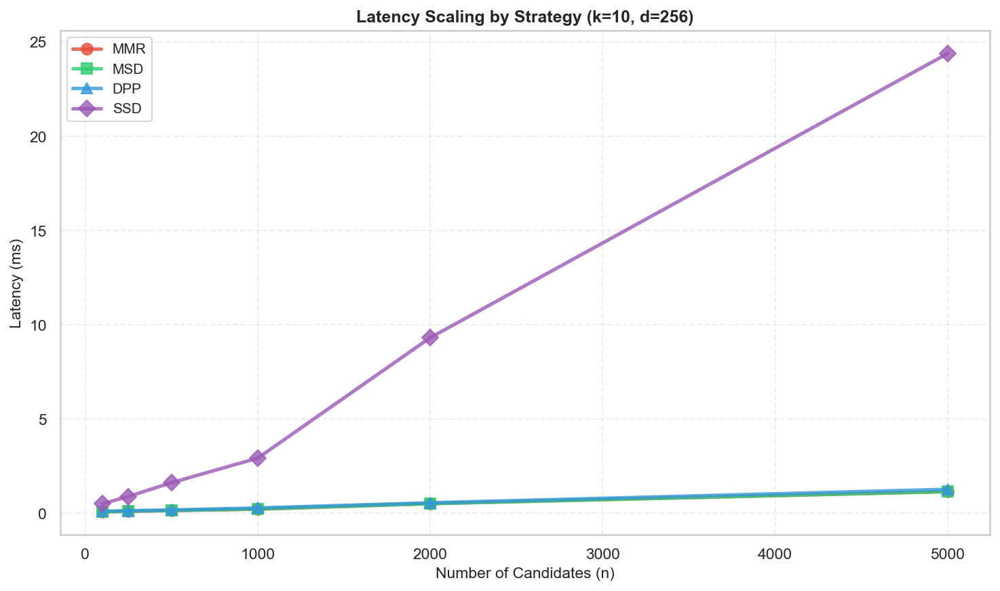

# Pyversity Benchmarks

Benchmarks for **MMR**, **MSD**, **DPP**, and **SSD** across 4 recommendation datasets.

Each dataset uses a leave-one-out evaluation: one item per user is held out as the test set, embeddings
are trained on the remaining interactions (preventing leakage), candidate items are generated, then
reranked with each diversification strategy. Relevance (nDCG) and diversity (ILAD, ILMD) are measured
to answer: *(1) how much can diversification improve relevance? (2) what's the relevance-diversity tradeoff?*

Latency scaling is also measured for each strategy.

> **Note:** COVER (coverage-based diversification) is not included because it optimizes a different
> objective (topic/category coverage) and requires explicit item taxonomies not available in standard
> collaborative filtering datasets.

## Table of Contents
- [Main Results](#main-results)
- [Plots](#plots)
- [Latency](#latency)
- [Detailed Results](#detailed-results)
- [Methodology](#methodology)
- [Usage](#usage)
- [Citations](#citations)

## Main Results

The results answer two questions:

1. **Accuracy**: Which strategy achieves the best relevance (nDCG)?
2. **Diversity under constraint**: How much diversity can you gain while maintaining relevance?

Diversity is measured with two metrics:
- **ILAD** (Intra-List Average Distance): average pairwise diversity—higher means more variety
- **ILMD** (Intra-List Minimum Distance): minimum pairwise diversity—higher means better worst-case diversity (fewer similar pairs)

### Table 1: Accuracy Leaderboard

Each strategy's best nDCG (selecting the `diversity` that maximizes relevance):

| Strategy | nDCG Δ | ILAD (+%) | ILMD (+%) | `diversity` |
|----------|:------:|:---------:|:---------:|:-----------:|
| **DPP**  | **+3.1%** | +26% | +54% | 0.5 |
| SSD      | +2.8% | +16% | +25% | 0.6 |
| MMR      | +1.5% | +11% | +17% | 0.4 |
| MSD      | +1.0% | +17% | +5% | 0.2 |

*nDCG Δ and ILAD/ILMD show % change vs baseline (`diversity=0`). Results are macro-averages: the best `diversity` is found per strategy per dataset, then averaged. 10 runs per dataset.*

### Table 2: Diversity Leaderboard (≥99% Relevance)

Best diversity per strategy while maintaining ≥99% of baseline nDCG, ranked by diversity score:

| Strategy | Diversity Score | nDCG Δ | ILAD (+%) | ILMD (+%) | `diversity` |
|----------|:---------------:|:------:|:---------:|:---------:|:-----------:|
| **DPP**  | **0.937** | +1.8% | +44% | **+86%** | 0.7 |
| SSD      | 0.625 | +2.0% | +29% | +43% | 0.8 |
| MMR      | 0.570 | +0.7% | +22% | +42% | 0.7 |
| MSD      | 0.267 | +0.5% | +33% | +9% | 0.3 |

*Diversity Score = geometric mean of normalized ILAD/ILMD gains (using feasible-max normalization). Higher = better balanced diversity.*

### Table 3: Diversity Leaderboard (≥95% Relevance)

Best diversity per strategy while maintaining ≥95% of baseline nDCG, ranked by diversity score:

| Strategy | Diversity Score | nDCG Δ | ILAD (+%) | ILMD (+%) | `diversity` |
|----------|:---------------:|:------:|:---------:|:---------:|:-----------:|
| **DPP**  | **0.889** | +0.2% | +49% | **+99%** | 0.8 |
| MMR      | 0.779 | -2.9% | +39% | +91% | 0.8 |
| SSD      | 0.537 | +1.5% | +31% | +49% | 0.8 |
| MSD      | 0.485 | -2.3% | +54% | +24% | 0.4 |

## Plots

### ILAD (Average Diversity)



*Higher ILAD = more overall variety in recommendations. ★ = best operating point at 95% floor, ◆ = best at 99% floor.*

### ILMD (Minimum Diversity)



*Higher ILMD = better worst-case diversity (fewer similar pairs). ★ = best operating point at 95% floor, ◆ = best at 99% floor.*

## Latency

All strategies are fast. Even with 10,000 candidates, all complete in <100ms. The plot below shows latency scaling measured on a **separate synthetic benchmark** (k=10, d=256 embeddings, typical for modern embedding models):



- **Typical use case** (100 candidates): all strategies complete in <1ms
- **MMR/MSD/DPP** are same order of magnitude; DPP is modestly slower at scale
- **SSD** is slower due to Gram-Schmidt orthogonalization, which scales with embedding dimension

| Strategy | 100 candidates | 1,000 candidates | 10,000 candidates |
|----------|----------------|------------------|-------------------|
| MMR | ~0.1ms | ~1ms | ~10ms |
| MSD | ~0.1ms | ~1ms | ~10ms |
| DPP | ~0.1ms | ~2ms | ~20ms |
| SSD | ~0.5ms | ~5ms | ~80ms |

*Measured with k=10 items selected, d=256 dimensional embeddings. Note: main benchmarks use d=64; latency benchmark uses d=256 to reflect modern embedding model dimensions.*

## Detailed Results

<details>
<summary>Per-Dataset Best Configs (99% Relevance Floor)</summary>

| Dataset | Max ILAD | Max ILMD | Best Combined |
|---------|:--------:|:--------:|:------------:|
| MovieLens-32M | DPP (`diversity`=0.8) | DPP (`diversity`=0.8) | DPP (`diversity`=0.8) |
| Last.FM | DPP (`diversity`=0.7) | DPP (`diversity`=0.7) | DPP (`diversity`=0.7) |
| Amazon-VG | MSD (`diversity`=0.4) | MMR (`diversity`=0.7) | MMR (`diversity`=0.7) |
| Goodreads | MSD (`diversity`=0.4) | DPP (`diversity`=0.7) | DPP (`diversity`=0.7) |

</details>

<details>
<summary>Per-Dataset Best Configs (95% Relevance Floor)</summary>

| Dataset | Max ILAD | Max ILMD | Best Combined |
|---------|:--------:|:--------:|:------------:|
| MovieLens-32M | DPP (`diversity`=0.9) | DPP (`diversity`=0.9) | DPP (`diversity`=0.9) |
| Last.FM | MSD (`diversity`=0.6) | DPP (`diversity`=0.8) | DPP (`diversity`=0.8) |
| Amazon-VG | MSD (`diversity`=0.5) | MMR (`diversity`=0.7) | MSD (`diversity`=0.5) |
| Goodreads | MSD (`diversity`=0.5) | DPP (`diversity`=0.8) | DPP (`diversity`=0.8) |

</details>

<details>
<summary>Per-Strategy Diversity Sweep (Averaged Across Datasets)</summary>

Shows how each strategy's metrics change as you increase `diversity`, **averaged across all 4 datasets**. Baseline values (ILAD=0.42, ILMD=0.12 at `diversity=0`) are the cross-dataset averages.

> **Note:** nDCG Retention can exceed 100% and may not decrease monotonically. This happens because
> diversification can sometimes *improve* relevance by breaking ties among similar items or surfacing
> items that better match the held-out test item. This effect is dataset-dependent and typically
> occurs at moderate diversity levels before eventually declining at high diversity.

#### MMR

| `diversity` | nDCG Retention | ILAD | ILMD |
|:-----------:|:--------------:|:----:|:----:|
| 0.0         | 100.0%          | 0.42 (+0%) | 0.12 (+0%) |
| 0.1         | 100.6%          | 0.42 (+1%) | 0.13 (+2%) |
| 0.2         | 101.0%          | 0.43 (+3%) | 0.13 (+5%) |
| 0.3         | 101.5%          | 0.44 (+4%) | 0.14 (+9%) |
| 0.4         | 101.7%          | 0.45 (+7%) | 0.15 (+15%) |
| 0.5         | 102.0%          | 0.46 (+10%) | 0.16 (+23%) |
| 0.6         | 102.2%          | 0.48 (+16%) | 0.18 (+36%) |
| 0.7         | 100.7%          | 0.52 (+25%) | 0.22 (+61%) |
| 0.8         | 95.5%          | 0.58 (+41%) | 0.28 (+111%) |
| 0.9         | 82.4%          | 0.71 (+79%) | 0.42 (+247%) |
| 1.0         | 48.0%          | 0.92 (+142%) | 0.76 (+656%) |

#### MSD

| `diversity` | nDCG Retention | ILAD | ILMD |
|:-----------:|:--------------:|:----:|:----:|
| 0.0         | 100.0%          | 0.42 (+0%) | 0.12 (+0%) |
| 0.1         | 101.5%          | 0.46 (+11%) | 0.13 (+4%) |
| 0.2         | 101.6%          | 0.50 (+22%) | 0.14 (+11%) |
| 0.3         | 100.9%          | 0.55 (+34%) | 0.16 (+19%) |
| 0.4         | 98.6%          | 0.60 (+48%) | 0.17 (+30%) |
| 0.5         | 94.9%          | 0.66 (+64%) | 0.20 (+45%) |
| 0.6         | 89.4%          | 0.72 (+84%) | 0.23 (+65%) |
| 0.7         | 81.3%          | 0.80 (+107%) | 0.26 (+92%) |
| 0.8         | 71.4%          | 0.87 (+129%) | 0.31 (+137%) |
| 0.9         | 57.7%          | 0.93 (+145%) | 0.40 (+225%) |
| 1.0         | 45.4%          | 0.95 (+152%) | 0.53 (+374%) |

#### DPP

| `diversity` | nDCG Retention | ILAD | ILMD |
|:-----------:|:--------------:|:----:|:----:|
| 0.0         | 100.0%          | 0.42 (+0%) | 0.12 (+0%) |
| 0.1         | 102.6%          | 0.47 (+13%) | 0.15 (+26%) |
| 0.2         | 103.0%          | 0.47 (+15%) | 0.15 (+29%) |
| 0.3         | 103.3%          | 0.48 (+17%) | 0.16 (+33%) |
| 0.4         | 103.6%          | 0.49 (+19%) | 0.16 (+38%) |
| 0.5         | 103.7%          | 0.50 (+23%) | 0.17 (+46%) |
| 0.6         | 103.9%          | 0.52 (+30%) | 0.18 (+57%) |
| 0.7         | 104.2%          | 0.56 (+41%) | 0.21 (+77%) |
| 0.8         | 101.6%          | 0.64 (+65%) | 0.25 (+118%) |
| 0.9         | 88.1%          | 0.80 (+111%) | 0.39 (+275%) |
| 1.0         | 47.3%          | 0.92 (+144%) | 0.74 (+624%) |

#### SSD

| `diversity` | nDCG Retention | ILAD | ILMD |
|:-----------:|:--------------:|:----:|:----:|
| 0.0         | 100.0%          | 0.42 (+0%) | 0.12 (+0%) |
| 0.1         | 100.3%          | 0.42 (+1%) | 0.12 (+1%) |
| 0.2         | 100.7%          | 0.43 (+2%) | 0.13 (+2%) |
| 0.3         | 101.2%          | 0.43 (+3%) | 0.13 (+4%) |
| 0.4         | 101.6%          | 0.44 (+4%) | 0.13 (+6%) |
| 0.5         | 102.3%          | 0.44 (+6%) | 0.14 (+10%) |
| 0.6         | 103.1%          | 0.46 (+10%) | 0.14 (+16%) |
| 0.7         | 103.9%          | 0.48 (+16%) | 0.15 (+25%) |
| 0.8         | 103.9%          | 0.53 (+31%) | 0.18 (+47%) |
| 0.9         | 90.7%          | 0.76 (+97%) | 0.29 (+147%) |
| 1.0         | 46.5%          | 0.94 (+148%) | 0.72 (+612%) |

*Percentages show gain vs baseline (diversity=0).*

</details>


## Methodology

### Datasets

| Dataset | Domain | Interactions | Source |
|---------|--------|--------------|--------|
| MovieLens-32M | Movies | 32M ratings | [GroupLens](https://grouplens.org/datasets/movielens/32m/) |
| Last.FM | Music | 92K plays | [HetRec 2011](http://ir.ii.uam.es/hetrec2011/) |
| Amazon Video Games | Games | 47K reviews | [UCSD](https://cseweb.ucsd.edu/~jmcauley/datasets.html) |
| Goodreads | Books | 869K ratings | [UCSD](https://sites.google.com/eng.ucsd.edu/ucsdbookgraph/) |

### Metrics

| Metric | Type | Description |
|--------|------|-------------|
| **nDCG@10** | Relevance | Normalized Discounted Cumulative Gain at position 10 |
| **ILAD** | Average diversity | Mean pairwise distance—measures overall variety |
| **ILMD** | Minimum diversity | Min pairwise distance—higher = better worst-case diversity |

ILAD and ILMD are computed as `1 - cosine_similarity` between item embeddings.

### Experimental Setup

- **Evaluation**: Leave-one-out protocol with up to 2,000 sampled users per dataset (all users if fewer)
- **Runs**: 10 runs per dataset with different random seeds for robust results (20,000 total evaluations)
- **Embeddings**: 64-dim truncated SVD on the item co-occurrence matrix (training interactions only; held-out edges excluded)
- **Candidates**: For each user, the union of top-50 similar items per profile item (via cosine similarity), scored by mean similarity to the profile. The held-out item is eligible; other already-interacted items are excluded
- **Selection**: k=10 items selected by each strategy
- **`diversity` sweep**: 0.0, 0.1, 0.2, ..., 0.9, 1.0

<details>
<summary>Evaluation details</summary>

Diversification is evaluated as a reranking step in a transductive next-item prediction setting. Item embeddings and candidate generation are learned from the interaction graph with the specific held-out edges removed; rerankers are compared on the resulting candidate lists. The held-out item is eligible as a candidate (the goal is to retrieve it), but other already-interacted items are excluded. This isolates the diversification question: "given fixed candidates and scores, which reranking strategy produces the best relevance-diversity tradeoff?"

**Why can diversification improve nDCG?** In leave-one-out evaluation, the baseline ranking (no diversification) often places many near-duplicate items at the top. Diversifiers act as intelligent tie-breakers: by spreading selections across different item neighborhoods, they increase the chance of including the held-out test item. This is why moderate diversification can *improve* relevance, not just diversity.

</details>

### Relevance-Budgeted Evaluation

A **relevance floor** ensures fair comparison:

1. **Baseline**: Compute baseline nDCG at `diversity=0` (no diversification) for each dataset
2. **Filter**: Keep only configs where nDCG meets the relevance floor
3. **Compare**: Among feasible configs, find which strategy achieves:
   - **Max ILAD**: Best overall diversity spread
   - **Max ILMD**: Best worst-case diversity (fewer similar pairs)
   - **Best Combined**: Best 2-way Diversity Score (ILAD × ILMD)

Results are reported at two relevance floors:
- **99%**: Near-zero relevance loss, production-safe
- **95%**: Balanced tradeoff with more diversity headroom

The **Diversity Score** (used in Tables 2-3) measures balanced diversity improvement:
- `ILAD_gain = (ILAD - ILAD_baseline) / (ILAD_feasible_max - ILAD_baseline)`
- `ILMD_gain = (ILMD - ILMD_baseline) / (ILMD_feasible_max - ILMD_baseline)`
- `Diversity Score = √(ILAD_gain × ILMD_gain)` (geometric mean)

This uses **feasible-max normalization**: the max is computed only over points meeting the relevance floor, ensuring fair comparison within each constraint level.

## Usage

```bash
# Download datasets
python -m benchmarks download

# Run benchmarks
python -m benchmarks run

# Generate report
python -m benchmarks report
```

<details>
<summary>Programmatic API</summary>

```python
from benchmarks import BenchmarkConfig, run_benchmark
from pyversity import Strategy

config = BenchmarkConfig(
    dataset_path="benchmarks/data/ml-32m",
    sample_users=2000,
    strategies=[Strategy.MMR, Strategy.DPP, Strategy.MSD, Strategy.SSD],
    diversity_values=[0.0, 0.3, 0.5, 0.7, 1.0],
)
results = run_benchmark(config)
```

</details>

## Citations

```bibtex
@article{harper2015movielens,
  title={The MovieLens Datasets: History and Context},
  author={Harper, F Maxwell and Konstan, Joseph A},
  journal={ACM TiiS}, year={2015}
}

@inproceedings{cantador2011hetrec,
  title={2nd Workshop on Information Heterogeneity and Fusion in Recommender Systems},
  author={Cantador, Iv{\'a}n and Brusilovsky, Peter and Kuflik, Tsvi},
  booktitle={RecSys}, year={2011}
}

@inproceedings{ni2019amazon,
  title={Justifying Recommendations using Distantly-Labeled Reviews and Fine-Grained Aspects},
  author={Ni, Jianmo and Li, Jiacheng and McAuley, Julian},
  booktitle={EMNLP}, year={2019}
}

@inproceedings{wan2018goodreads,
  title={Item Recommendation on Monotonic Behavior Chains},
  author={Wan, Mengting and McAuley, Julian},
  booktitle={RecSys}, year={2018}
}
```
